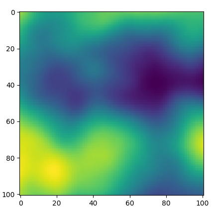
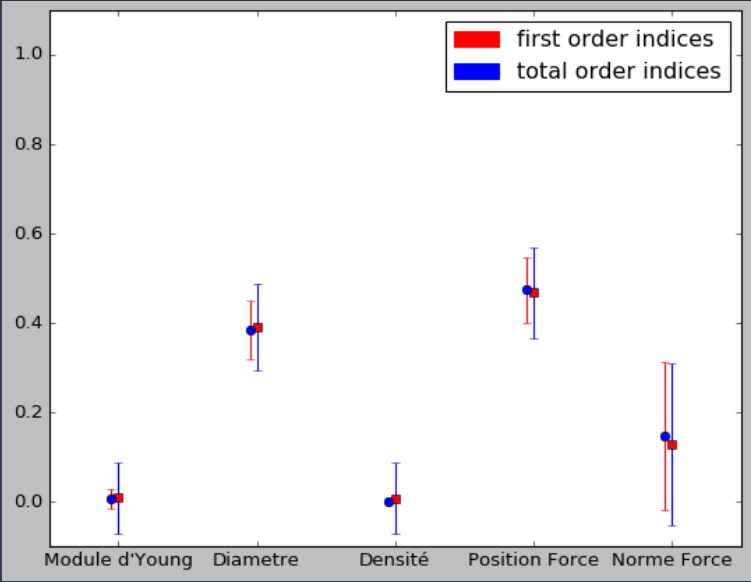

# SPSA : Stochastic Process Sensitivity Analysis

This repository contains codes used for sensitity analysis on models governed by stochastic processes and random input variables. 
They were done in the frame of an internship at [PHIMECA](http://www.phimeca.com/) in Clermont-Ferrand.

## Aim of the project

It is of common practice today to carry out sensitivity analysis on the item we desire to produce. It allows to get a beter understanding of the products behaviour during and after manufacture, and to master the uncertain nature of reality. This method allows us to know which parameter uncertainty will have the most influence on the products outcome, and *in fine*, know where to invest the most effort to reduce uncertainties.

Sensitivity analysis itself is, although being almost 30 years old, a rather new discipline with it's limitations. In fact, sensitivity analysis is usually carried out on scalar uncertainties (like a length, a diameter, a frequency...) and not so often on more complex random structures, as random fields. The aim of this project is to develop a set of usable codes, that will allow to carry out sensitivity analysis on models where the input uncertainty is not only scalar, but can also occur under the form of random fields. 

The methodology was based on different research papers, with the principal idea gotten from a 2017 paper called **"Time-variant global reliability sensitivity analysis of structures with both input random variables and stochastic processes"** from **P. Wei, Y. Wang & C. Tang**. The methodology is explained in the report (in *French*...).

## Getting Started

To use the codes, please install the virtual environment provided in the yaml file. A throughout example can be found in the 
"Demo Analyse de sensibilité poutre" notebook, but for the moment only in french (Sorry).

### Prerequisites

Works with python 3.6, but should work with other versions of python through the intensive usage of numpy.

Important packages used:
 - openTURNS
 - NumPy
 - Numba (not really used, but acceleration could be intersting)
 - anastruct (for the random beam example)

### Installing

To install the module, clone the repository and execute: 
```
python setup.py -install 
```
### Documentation
[documentation](https://htmlpreview.github.io/?https://raw.githubusercontent.com/Kramer84/spsa/master/docs/_build/html/index.html)

## Usage

#### Creating stochastic processes:

```python
from spsa import StochasticProcessConstructor as SPC
import matplotlib.pyplot as plt

stochasticProcess = SPC.StochasticProcessConstructor() 
stochasticProcess.setDimension(2)
stochasticProcess.setGrid([[0,100,100],[0,100,100],])
stochasticProcess.setCovarianceModel({'Model':'MaternModel','scale':[25,25],'amplitude':[5],'nu':3.})
realization = stochasticProcess.getRealization(True) #True to get it as a reshaped numpy array and not a openturns object
plt.imshow(realization)
```
*Realization of a two dimensional stochastic process*



#### Sensitivity analysis with stochastic fields:
This is in the case where you have a function that takes as an input fields and random variables, but also random variables alone or only fields.
The general case would be to have a function **F(X,Y) = U,V**, where **X** and **Y** would be a collection of fields and scalars, and the the outputs **U** and **V** would also be fields and scalars. 

```python
from spsa import StochasticProcessConstructor as SPC
from spsa import StochasticProcessSensitivity as SPS
import openturns as ot

RV0 = ot.Normal()        #Centered and reduced normal law
SP0 = stochasticProcess  #The stochastic process from above
outputs = {1:{'name':'U','position':0,'shape':(1,)},2:{'name':'V','position':1,'shape':(10,10)}} #We have to know the name, the position in the output tuple, as well as the dimension
size = 1000 #size of the sobol experiment
singleFunc = Fsingle #Function doing single evaluations
sampleFunc = Fsample #Function doing multiple evaluations

sensitivityAnalysis = SPS.StochasticProcessSensitivityAnalysis([RV0, SP0], outputs, sampleFunc, singleFunc, size)
sensitivityAnalysis.run(generationType = 1)
sensitivityAnalysis.getSensitivityAnalysisResults()
results = sensitivityAnalysis.SensitivityAnalysisResults
resutls[0].draw()
#This is a dummy example
```
*Example of sobol indices (not relevant to the example)*




## Built With

* [openTURNS](https://github.com/openturns/openturns) - Codes and methods for efficient sensitivity analysis
* [anaStruct](https://github.com/ritchie46/anaStruct) - 2D efficient finite element analysis in Python
* [Numba](https://numba.pydata.org/)                  - Easy code acceleration 

## Contributing

As this project is done in the frame of an internship with the company PHIMECA in Clermont-Ferrand, France, i should be the only one commiting for now.

## Authors

* **Kristof S.** - *Initial work* 

## Acknowledgments

* A lot of thanks to Ritchie Vink and the superb anastruct library : https://www.ritchievink.com/
* Also a lot of thanks to PHIMECA and the team working on openTURNS, for their really efficient sensitivity analysis library
